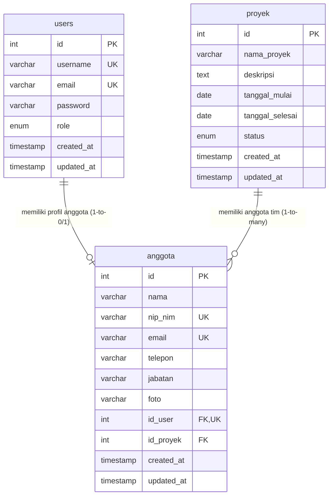

# Entity Relationship Diagram (ERD) - Cloud Team Management

Berikut adalah rancangan diagram hubungan entitas (ERD) untuk database `cloud_team_management_db`.

## Diagram Mermaid

Anda dapat melihat diagram di bawah ini di platform yang mendukung rendering Mermaid (seperti GitHub atau extension Markdown Preview).

## Deskripsi Hubungan

1. **`users` ke `anggota` (One-to-One / 1:0..1)**
   - Setiap pengguna (`users`) dapat memiliki maksimal satu profil anggota (`anggota`).
   - Setiap anggota (`anggota`) dapat dikaitkan dengan satu akun pengguna (`users`) untuk login ke sistem, atau tidak memiliki akun sama sekali (diwakili dengan nilai `NULL` pada foreign key `id_user`).
   
2. **`proyek` ke `anggota` (One-to-Many / 1:N)**
   - Setiap proyek (`proyek`) dapat menampung banyak anggota tim (`anggota`).
   - Setiap anggota (`anggota`) hanya dapat ditugaskan pada satu proyek dalam satu waktu (diwakili dengan foreign key `id_proyek`). Jika anggota tidak ditugaskan ke proyek mana pun, nilai foreign key bernilai `NULL`.
