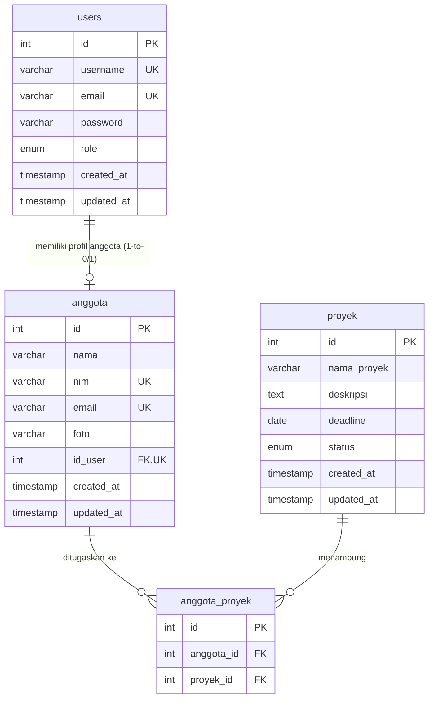

# Entity Relationship Diagram (ERD) - Cloud Team Management

Berikut adalah rancangan diagram hubungan entitas (ERD) untuk database `cloud_team_management_db`.

## Diagram Mermaid

Anda dapat melihat diagram di bawah ini di platform yang mendukung rendering Mermaid (seperti GitHub atau extension Markdown Preview).

## Deskripsi Hubungan

1. **`users` ke `anggota` (One-to-One / 1:0..1)**
   - Setiap pengguna (`users`) dapat memiliki maksimal satu profil anggota (`anggota`).
   - Setiap anggota (`anggota`) dapat dikaitkan dengan satu akun pengguna (`users`) untuk login ke sistem, atau tidak memiliki akun sama sekali (diwakili dengan nilai `NULL` pada foreign key `id_user`).
   
2. **`anggota` ke `proyek` (Many-to-Many / M:N)**
   - Dihubungkan melalui tabel pivot `anggota_proyek`.
   - Satu anggota dapat ditugaskan ke banyak proyek, dan satu proyek dapat memiliki banyak anggota tim. Hal ini memberikan fleksibilitas alokasi sumber daya tim yang maksimal.
